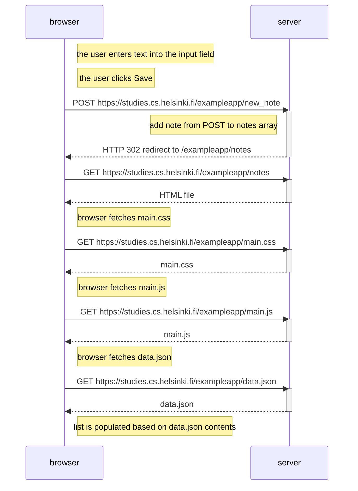

```mermaid
sequenceDiagram
participant browser
participant server

    Note right of browser: the user enters text into the input field
    Note right of browser: the user clicks Save
    browser->>server: POST https://studies.cs.helsinki.fi/exampleapp/new_note
    activate server
    Note left of server: add note from POST to notes array
    server-->>browser: HTTP 302 redirect to /exampleapp/notes
    deactivate server

    browser->>server: GET https://studies.cs.helsinki.fi/exampleapp/notes
    activate server
    server-->>browser: HTML file
    deactivate server

    Note right of browser: browser fetches main.css
    browser->>server: GET https://studies.cs.helsinki.fi/exampleapp/main.css
    activate server
    server-->>browser: main.css
    deactivate server

    Note right of browser: browser fetches main.js
    browser->>server: GET https://studies.cs.helsinki.fi/exampleapp/main.js
    activate server
    server-->>browser: main.js
    deactivate server

    Note right of browser: browser fetches data.json
    browser->>server: GET https://studies.cs.helsinki.fi/exampleapp/data.json
    activate server
    server-->>browser: data.json
    deactivate server

    Note right of browser: list is populated based on data.json contents
```